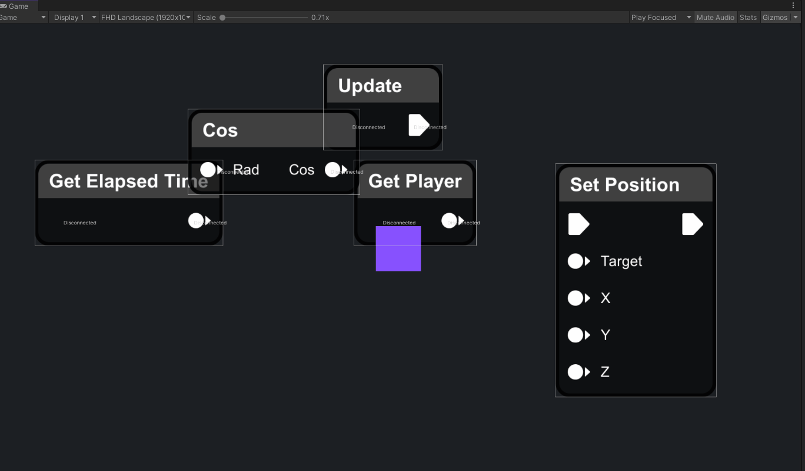

# Runtime Visual Scripting



It's an experimental project, I'm still not happy with the way nodes are created, a simple node like SetPosition ends up having 35 lines, and that's not what I want. I'll keep experimenting and see what I can get.

## Node Samples
### Get Elapsed Time
```csharp
using UnityEngine;

public class GetElapsedTimeNode : Node
{
    private void Start()
    {
        SetTitle("Get Elapsed Time");
        AddParameterOutput<float>((_) => Time.time);
    }
}
```

### Cos
```csharp
using UnityEngine;

public class CosNode : Node
{
    private void Start()
    {
        SetTitle("Cos");
        var rad = AddParameterInput<float>((socket) => (float) (socket.Connection ? socket.Connection.Evaluate : default(float)), "Rad");
        AddParameterOutput<float>((socket) => Mathf.Cos((float) rad.Evaluate), "Cos");
    }
}
```

### Set Position
```csharp
using UnityEngine;

public class SetPositionNode : Node
{
    private Socket _target;
    private Socket _x;
    private Socket _y;
    private Socket _z;

    private Socket _next;

    private void Start()
    {
        SetTitle("Set Position");
        AddExecutionInput((socket) => SetPosition());
        _next = AddExecutionOutput((socket) => { socket.Connection?.Execute(); });
        _target = AddParameterInput<GameObject>((socket) => (GameObject) (socket.Connection ? socket.Connection.Evaluate : null), "Target");
        _x = AddParameterInput<float>((socket) => (float) (socket.Connection ? socket.Connection.Evaluate : default(float)), "X");
        _y = AddParameterInput<float>((socket) => (float) (socket.Connection ? socket.Connection.Evaluate : default(float)), "Y");
        _z = AddParameterInput<float>((socket) => (float) (socket.Connection ? socket.Connection.Evaluate : default(float)), "Z");
    }

    private void SetPosition()
    {
        var target = (GameObject) _target.Evaluate;
        
        if (target != null)
        {
            var position = new Vector3((float) _x.Evaluate, (float) _y.Evaluate, (float) _z.Evaluate);
            target.transform.position = position;
        }

        _next.Execute();
    }
}
```

## Contributing
  
Here’s how we suggest you go about proposing a change to this project:
  
1. [Fork this project][fork] to your account.
2. [Create a branch][branch] for the change you intend to make.
3. Make your changes to your fork.
4. [Send a pull request][pr] from your fork’s branch to our `master` branch.
  
Using the web-based interface to make changes is fine too, and will help you
by automatically forking the project and prompting to send a pull request too.
  
[fork]: https://help.github.com/articles/fork-a-repo/
[branch]: https://help.github.com/articles/creating-and-deleting-branches-within-your-repository
[pr]: https://help.github.com/articles/using-pull-requests/
